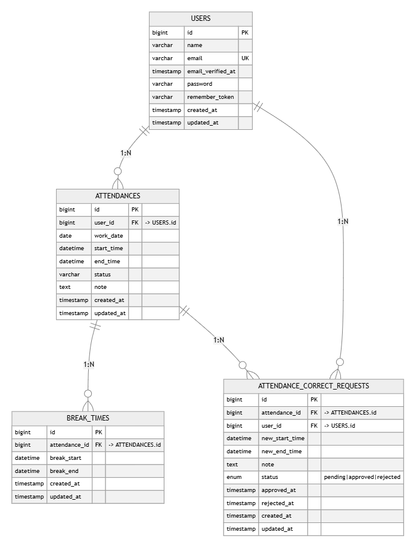

# COACHTECH 勤怠管理アプリ

## 環境構築

# 1. リポジトリをクローン → .env 作成
```bash
cp src/.env.example src/.env
```
# 2. .evn 設定（src/.env）
## DB 設定
DB_CONNECTION=mysql
DB_HOST=mysql_db
DB_PORT=3306
DB_DATABASE=attendance_db
DB_USERNAME=root
DB_PASSWORD=password
## メール送信設定
MAIL_MAILER=smtp
MAIL_HOST=mailhog
MAIL_PORT=1025
MAIL_USERNAME=null
MAIL_PASSWORD=null
MAIL_ENCRYPTION=null
MAIL_FROM_ADDRESS=no-reply@example.test
MAIL_FROM_NAME="COACHTECH Attendance"

# 3. コンテナ起動
```bash
docker compose up -d --build
```

# 4. 依存インストール & アプリキー
```bash
docker compose exec app composer install -o
docker compose exec app php artisan key:generate
```

# 5. マイグレーション & シーディング
```bash
docker compose exec app php artisan migrate --seed
```

# 6. フロントエンド
```bash
cd src
npm install
# 開発
npm run dev
# 本番ビルド
npm run build
```
---

# pull 後の再セットアップ（環境差の不具合を防ぐ）
```bash
# 1) コンテナをビルド・起動
docker compose up -d --build

# 2) PHP 依存を再インストール
docker compose exec app composer install -o

# 3) .env を MySQL + file セッションに統一
docker compose exec app bash -lc "
sed -i '
s/^DB_CONNECTION=.*/DB_CONNECTION=mysql/;
s/^DB_HOST=.*/DB_HOST=mysql_db/;
s/^DB_PORT=.*/DB_PORT=3306/;
s/^DB_DATABASE=.*/DB_DATABASE=attendance_db/;
s/^DB_USERNAME=.*/DB_USERNAME=root/;
s/^DB_PASSWORD=.*/DB_PASSWORD=password/;
s/^SESSION_DRIVER=.*/SESSION_DRIVER=file/
' .env || true
"

# 4) Laravel のキャッシュを全削除
docker compose exec app php artisan optimize:clear

# 5) マイグレーション（必要に応じて）
docker compose exec app php artisan migrate --force || true

# 6) storage / cache の権限整備
docker compose exec app bash -lc '
mkdir -p storage/framework/{cache,sessions,views} bootstrap/cache
chown -R www-data:www-data storage bootstrap/cache
find storage bootstrap/cache -type d -exec chmod 775 {} \;
find storage bootstrap/cache -type f -exec chmod 664 {} \;
'
```

---

## 使用技術
- PHP 8.3.26 / Laravel 12.21.0
- MySQL 8.0
- Docker / Docker Compose
- nginx 1.29.1
- Mailhog

---

## 主要機能
- 一般ユーザー
  - 会員登録 / ログイン
  - 勤怠打刻（出勤・退勤・休憩）
  - 勤怠詳細確認・修正申請
- 管理者
  - 管理者ログイン
  - 勤怠一覧 / 詳細 / 承認機能
  - スタッフ一覧・月次勤怠確認

---

## 画面一覧
- `/register`：会員登録
- `/login`：ログイン
- `/attendance`：勤怠登録（打刻）
- `/attendance/{id}`：勤怠詳細
- `/stamp_correction_request/list`：申請一覧
- `/admin/login`：管理者ログイン
- `/admin/attendance/list`：勤怠一覧
- `/admin/attendance/staff/{id}`：スタッフ別勤怠一覧

---

## テーブル仕様（例）

### users
| カラム名 | 型 | 制約 |
| --- | --- | --- |
| id | bigint / unsigned bigInteger (PK) | PK |
| name | varchar(255) | not null |
| email | varchar(255) | unique, not null |
| email_verified_at | timestamp | nullable |
| password | varchar(255) | not null |
| remember_token | varchar(100) | nullable |
| created_at / updated_at | timestamp |  |
| is_first_login | boolean | not null |
| is_admin | boolean | not null |

### attendances
| カラム名 | 型 | 制約 |
| --- | --- | --- |
| id | bigint / unsigned bigInteger (PK) | PK |
| user_id | bigint / unsigned bigInteger | FK -> users.id, not null |
| work_date | date | not null |
| start_time | time / datetime | nullable |
| end_time | time / datetime | nullable |
| note | text | nullable |
| created_at / updated_at | timestamp |  |

---

## ER図


---

## テストアカウント
- 一般ユーザー
  - email: user@example.com
  - password: password123
- 管理者
  - email: admin@example.com
  - password: password123

---

## メール承認
- MailHog
  - http://localhost:8025

---

## テスト実行
```bash
docker compose exec app php artisan test
```
