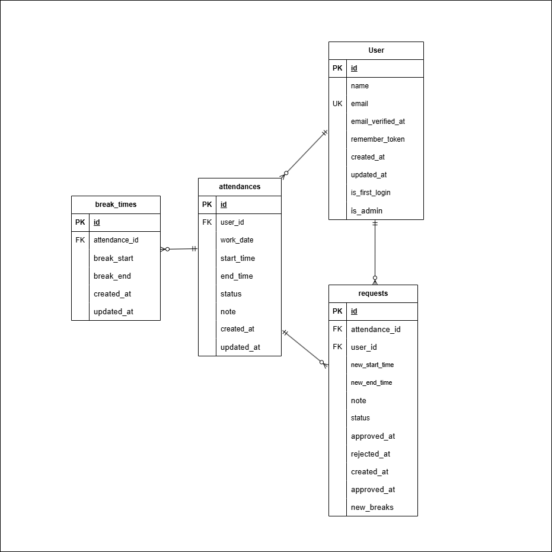

# COACHTECH 勤怠管理アプリ

## 環境構築

1. Docker を起動する  
2. プロジェクト直下で以下を実行
   ```bash
   make init
   ```
   ※ Makefile によって主要コマンドを省略可能

3. コンテナ起動後、以下でマイグレーションとシーディングを実行
   ```bash
   docker compose exec app php artisan migrate --seed
   ```

---

## 使用技術
- PHP 8.x / Laravel 10.x
- MySQL 8.x
- Docker / Docker Compose
- PHPUnit

---

## 主要機能
- 一般ユーザー
  - 会員登録 / ログイン
  - 勤怠打刻（出勤・退勤・休憩）
  - 勤怠詳細確認・修正申請
- 管理者
  - 管理者ログイン
  - 勤怠一覧 / 詳細 / 承認機能
  - スタッフ一覧・月次勤怠確認

---

## 画面一覧
- `/register`：会員登録
- `/login`：ログイン
- `/attendance`：勤怠登録（打刻）
- `/attendance/{id}`：勤怠詳細
- `/stamp_correction_request/list`：申請一覧
- `/admin/login`：管理者ログイン
- `/admin/attendance/list`：勤怠一覧
- `/admin/attendance/staff/{id}`：スタッフ別勤怠一覧

---

## テーブル仕様（例）
### users
| カラム名 | 型 | 制約 |
| --- | --- | --- |
| id | bigint | PK |
| name | varchar(255) | not null |
| email | varchar(255) | unique, not null |
| password | varchar(255) | not null |
| created_at / updated_at | timestamp |  |

### attendances
| カラム名 | 型 | 制約 |
| --- | --- | --- |
| id | bigint | PK |
| user_id | bigint | FK(users.id) |
| work_date | date | not null |
| start_time | time |  |
| end_time | time |  |
| note | text |  |
| created_at / updated_at | timestamp |  |

---

## ER図


---

## テストアカウント
- 一般ユーザー
  - email: user@example.com
  - password: password123
- 管理者
  - email: admin@example.com
  - password: password123

---

## テスト実行
```bash
docker compose exec app php artisan test
```
